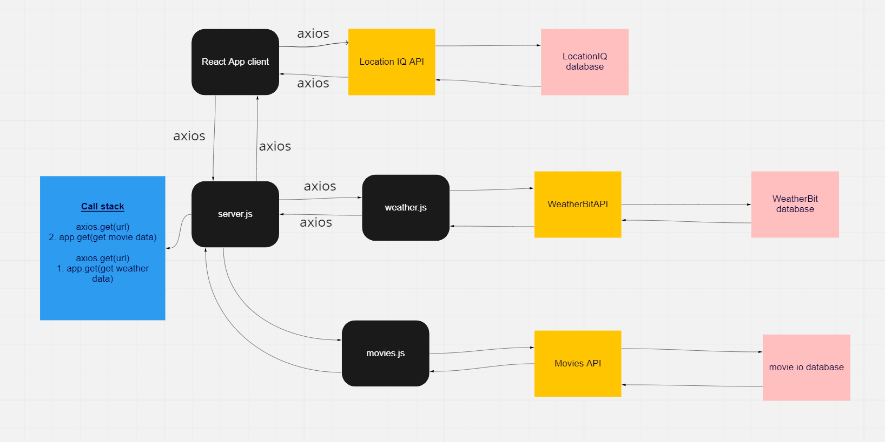

# City Explorer

**Author**: Luis Sandoval
**Version**: 1.0.8

## Overview
This web app uses Axios to request data from a location API, Weather API, and Movies API based on user input and provide that information to the user.

## Getting Started
[Trello Board](https://trello.com/b/aGo44h6k/city-explorer)

## Architecture

- ReactJS

- ExpressJS

- NodeJS

## Change Log
<!-- Use this area to document the iterative changes made to your application as each feature is successfully implemented. Use time stamps. Here's an example:

01-01-2001 4:59pm - Application now has a fully-functional express server, with a GET route for the location resource. -->

## Credit and Collaborations
<!-- Give credit (and a link) to other people or resources that helped you build this application. -->

- Derek Douglas

- Zayah Lang

- Jim Doyle

- Martha Quintanilla-Ramirez

- Natalija Germek

- Tanesha

Name of feature: City Explorer Lab 09

Estimate of time needed to complete: 2.5 Hours

Start time: 12:30

Finish time: 2:15

Actual time needed to complete: 1.75 Hours
